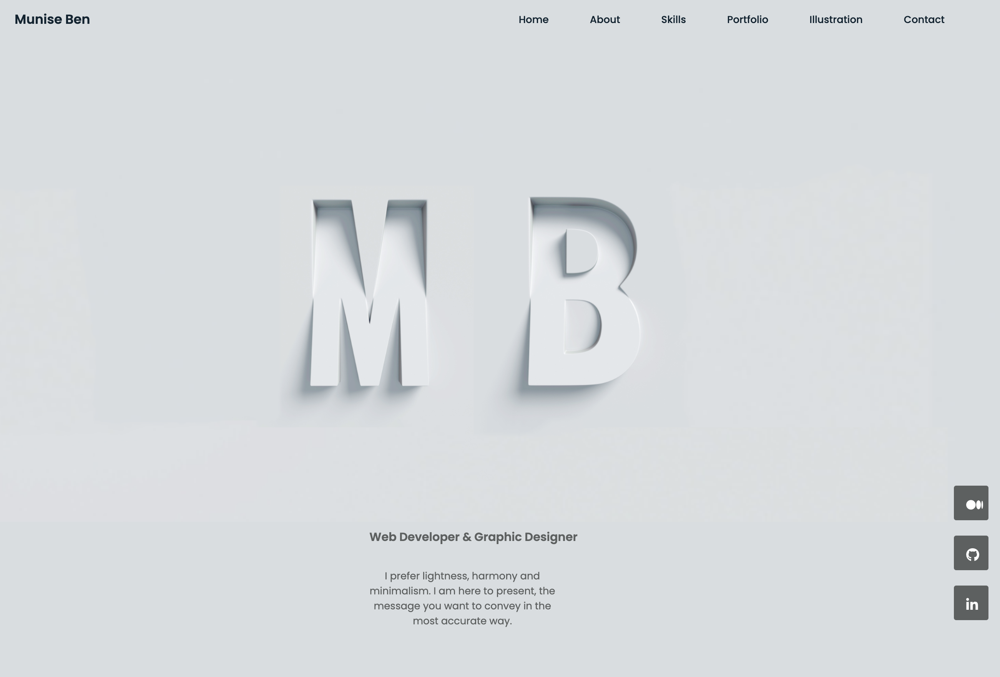
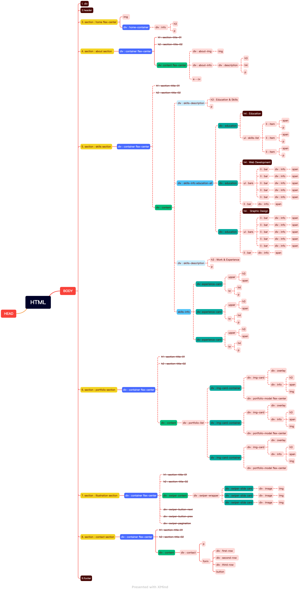
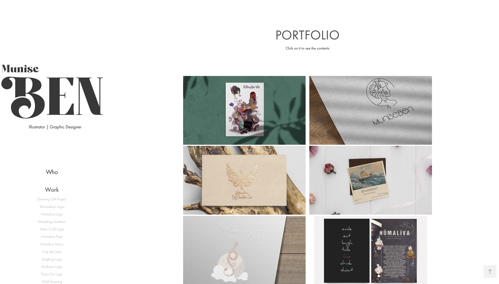

# My Website (November - December 2022)

> ## Why did I make this website?

I am an Adobe fan and have been using the Adobe Portfolio to build and maintain my personal website for the past year. I had to pay a high monthly fee for this service. But I don't need to do that anymore because I can now build my own website.

> ## The image of my new website that I prepared with HTML & CSS & JavaScript

> ## Document Object Model I have prepared

> ## The image of my old website that I created on a Adobe platform

